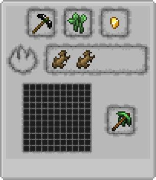
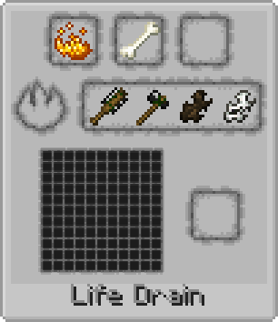
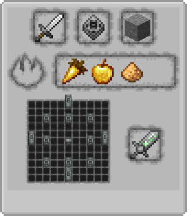

# Flint Tools in Roots Rituals
Replaces wooden tools used in [Roots Classic](https://www.curseforge.com/minecraft/mc-mods/roots-classic) rituals with flint tools from [No Tree Punching](https://www.curseforge.com/minecraft/mc-mods/no-tree-punching) to get around the removal of wooden tools.

The recipe for the Engraved Blade is also changed since stone tools are removed as well.

  